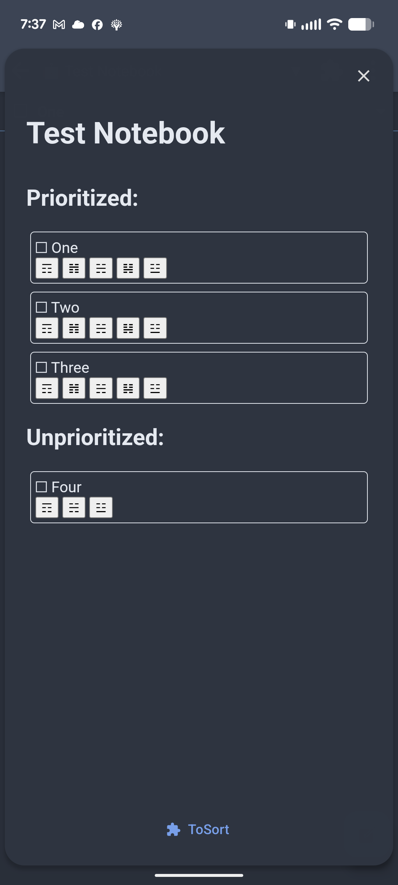

# ToSort: A Joplin Plugin to sort your to-dos

In Joplin's mobile client, there is no way to sort your notes when using custom ordering, which is critical in some workflows.

This plugin adds a panel to the UI which (though ugly) allows you to do this.

## Caveat

This plugin is in its early stages of development, so it definitely has some rough edges:

 - Needs a cleaner UI (theming and layout)
 - Needs a snappier UX (Drag & Drop?)
 - Needs to be more responsive to external factors (folder changes, incoming syncs)
 - Probably many bugs since I'm new to typescript and the Joplin plugin API

## Usage

But for now, at least the basics work (most of the time):

  1. Select a folder (and open a note within that folder so the plugin notices the folder change)
  2. Open the panel (via the puzzle-piece icon in the top right)
  3. Incomplete to-dos (not all notes) are shown in 2 groups:
     - Prioritized (those that have already been sorted)
     - Unprioritized (those that have not been)
  4. Each to-do shows its title and some buttons to change its position in the list.
  5. Clicking the buttons moves the to-do to:
     - ☶ Top of list
     - 𝌥 Up by one
     - ☵ Middle of list
     - 𝌫 Down by one
     - ☳ Bottom of list
  6. The change is immediately shown in the note list (if you have selected custom sorting) and is synced to other clients (like desktop)
